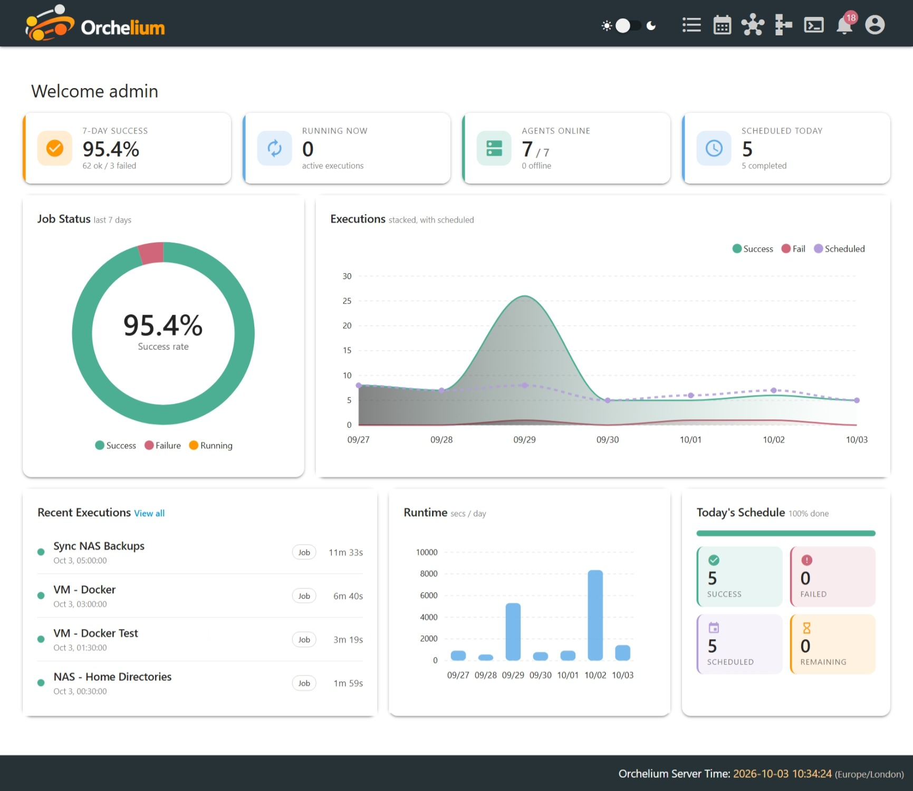
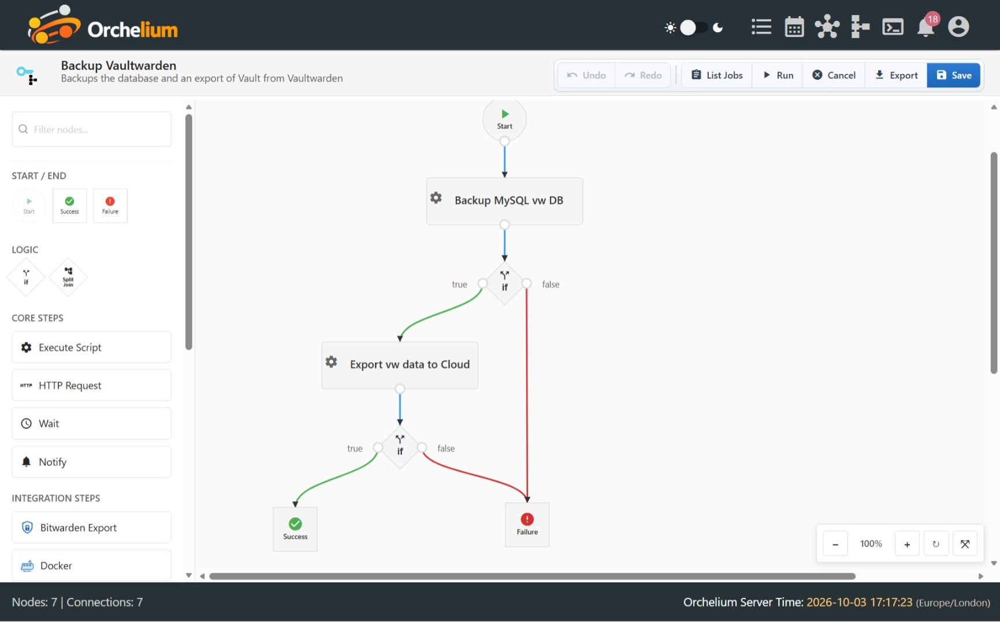

# Orchelium


**Backup Orchestration for Home Labs.**

Centralised, unified backup workflows across Proxmox, NAS servers, ZFS pools, containers, databases, and cloud storage — from one visual interface.



---

## The Problem

Every system in your home lab has its own backup schedule, its own script, its own log. Proxmox backups buried in datacenter config. ZFS snapshots managed per-pool. rsync cron jobs scattered across a dozen machines. Restic and Borg jobs you haven't verified in months. No unified dashboard, no central alert, no single place to know whether last night's backups actually worked.

Orchelium fixes this.

---

## Key Features

### Backup-First Orchestration
Orchelium was built specifically for the challenges of home-lab backup workflows:

- **Proxmox** — snapshot, backup, and verify VMs and LXC containers across multiple hosts
- **ZFS** — create snapshots, send to remote pools, prune, and verify integrity in one chain
- **Restic & Borg** — run, check, prune, and verify; structured output lets downstream nodes react automatically
- **rsync & rclone** — sync between local paths, remote hosts, or cloud storage (S3, Backblaze B2, and more)
- **Databases** — native plugins for MySQL, PostgreSQL, and SQLite
- **Pre/post scripts** — quiesce VMs, mount pools, dump databases, then clean up — all in the workflow chain
- **Backup verification** — chain a verify step after every backup; failures block downstream steps and trigger alerts
- **Failure alerts** — instant notifications via Discord, Telegram, or email

### Visual Workflow Builder
Design multi-step backup pipelines using a drag-and-drop node editor:
- Sequential or parallel execution
- Conditional branching
- Real-time step-by-step monitoring
- Live log streaming from every node



### Plugin Ecosystem
19+ official plugins covering backup, databases, file sync, storage, containers, and system tools. Install in one click from the Plugin Manager. Browse the catalog at [orchelium.com/plugins](https://orchelium.com/plugins/).

### Multi-Agent Architecture
Lightweight agents run on any Linux machine — Proxmox hosts, NAS servers, VMs, Docker hosts:
- Encrypted WebSocket or MQTT transport
- Real-time status and heartbeat
- Live log streaming
- Auto-reconnect

### Advanced Scheduler
Trigger workflows from:
- Cron-style schedules
- Threshold rules (CPU, disk, memory)
- Webhooks (Home Assistant, GitHub Actions, Proxmox hooks, any HTTP source)
- Agent online/offline events

---

## Quick Start

### Run the Hub

```bash
docker run \
  -d \
  --name Orchelium \
  -e TZ=Europe/London \
  -p 8082:8082 \
  -p 49991:49981 \
  --restart unless-stopped \
  -v /custom/Orchelium/data:/usr/src/app/data \
  -v /custom/Orchelium/scripts:/usr/src/app/scripts \
  -v /custom/Orchelium/logs:/usr/src/app/logs \
  -v /custom/Orchelium/plugins:/usr/src/app/plugins \
  ghcr.io/dpembo/orchelium/hub:latest
```

Open [http://localhost:8082](http://localhost:8082) in your browser. See the [installation guide](./docs/installation.md) for all parameters, environment variables and a Docker Compose example.

### Install an Agent

Generate a registration command from the UI, then run it on any Linux machine. Agents register automatically, authenticate, and begin streaming status and logs immediately.

---

## Plugin Ecosystem

Official plugins are maintained in a separate repository:

**[dpembo/orchelium-plugins](https://github.com/dpembo/orchelium-plugins)**

Plugins use a simple `plugin.yaml` + shell script format and are easy to write. See the [Plugin Developer Guide](./docs/Developers/Engine_Updates/PLUGIN_DEVELOPER_GUIDE.md) to contribute.

---

## Documentation

Full documentation: [docs/](./docs/README.MD)

| Guide | Description |
|---|---|
| [Installation](./docs/installation.md) | Deploy the hub and agents |
| [Orchestrations](./docs/orchestrations.md) | Build and run workflows |
| [Plugin Manager](./docs/plugins.md) | Install and manage plugins |
| [REST API](./docs/REST_API_REFERENCE.md) | Automate via HTTP |
| [Webhooks](./docs/WEBHOOK_USER_GUIDE.md) | Trigger jobs from external systems |
| [Backup Schedules](./docs/backup-schedules.md) | Scheduling reference |

Extended docs also available at [deepwiki.com/dpembo/orchelium](https://deepwiki.com/dpembo/orchelium).

---

## Related Repositories

| Repo | Description |
|---|---|
| [dpembo/orchelium-plugins](https://github.com/dpembo/orchelium-plugins) | Official plugin registry (19+ plugins) |

---

## Contributing

Contributions are welcome — bug reports, feature ideas, pull requests, and new plugins. See [CONTRIBUTING.md](./CONTRIBUTING.md) (coming soon) or open an issue to start a discussion.

---

## Support

- [GitHub Issues](https://github.com/dpembo/orchelium/issues) — bugs and feature requests
- [GitHub Discussions](https://github.com/dpembo/orchelium/discussions) — general questions and ideas

---

## License

Apache License 2.0 — see [LICENSE](./LICENSE) for details.

